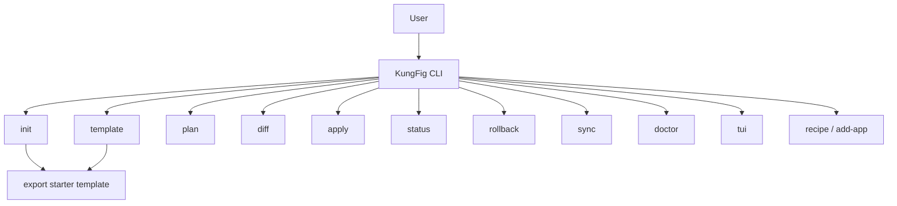
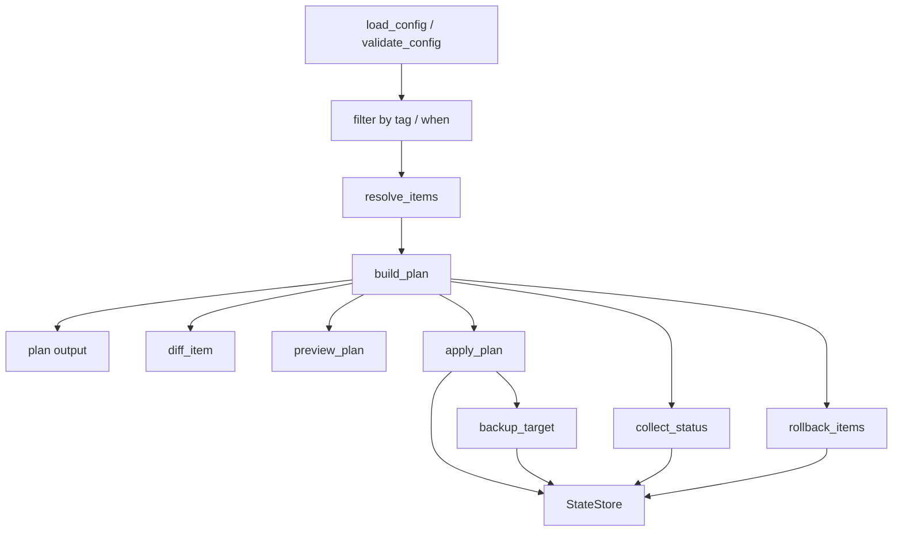
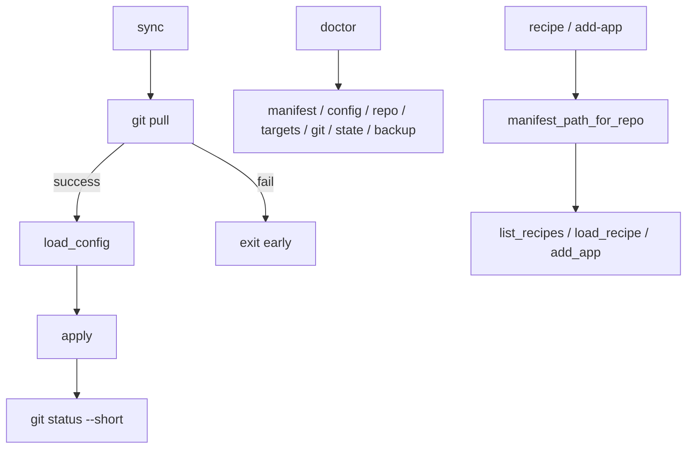

# KungFig

KungFig is a cross-platform configuration manager written in Rust.

## Features

- Cross-platform support
- Declarative configuration
- Variable interpolation
- Tags and `when` conditions
- Plan / diff / apply / sync workflow
- Backup and rollback support
- SQLite state tracking
- Template rendering
- Recipe import and app bootstrap

## Dependencies

- clap: command line interface
- crossterm: terminal input/output
- serde: serialization/deserialization
- toml: read TOML files
- directories: read directory paths
- ratatui: terminal UI rendering
- similar: render text diffs
- sha2: compute file and tree digests
- hex: encode hashes
- rusqlite: persist managed files and backups
- anyhow: ergonomic error handling
- thiserror: typed internal errors

## Quick Start

- `init`

Create a starter manifest in the current directory, or write it to a custom path with `--manifest` and `--force`.

```bash
kungfig init
kungfig init --force
kungfig --manifest configs/kungfig.toml init --force
```

- `template`

Export the starter TOML template to stdout, or write it to a custom file with `--output`.

```bash
kungfig template
kungfig template --output kungfig.toml
```

- `plan`

Preview the actions KungFig would take, and narrow the output to tagged items when needed.

```bash
kungfig plan
kungfig plan --tag git
```

- `diff`

Inspect full per-item diffs, or focus on a single managed item by name or alias.

```bash
kungfig diff
kungfig diff gitconfig
kungfig diff git
```

- `edit`

Open the selected item's source, and use the shorter `alias` when you do not want to type the full `name`.

```bash
kungfig edit gitconfig
kungfig edit git
```

- `apply`

Materialize sources into their targets, or do a safe dry run before changing anything.

```bash
kungfig apply
kungfig apply --dry-run
```

- `status`

Check which items are synced, modified, or pending, optionally filtered by tag.

```bash
kungfig status
kungfig status --tag core
```

- `rollback`

Restore the latest backup for managed items, which is especially useful after a bad edit.

```bash
kungfig rollback
kungfig rollback --tag git
```

- `sync`

Pull the latest repository changes, then apply the manifest and report git status.

```bash
kungfig sync
```

- `doctor`

Run a quick health check for the manifest, source tree, targets, git, and local state paths.

```bash
kungfig doctor
```

- `tui`

Open the ratatui dashboard. You can start it directly or pair it with a command to pick the initial view.

```bash
kungfig tui
kungfig tui plan
kungfig tui diff gitconfig
```

## Workflow

### Command Entry



### Manifest Execution



### Sync And Ops



## Manifest

The starter manifest defaults to [kungfig.toml](kungfig.toml), but you can point `--manifest` at another path.

### Fields

- items

| field  |                description                |
| :----: | :---------------------------------------: |
|  name  |                 file name                 |
| alias  |           optional CLI shortcut           |
| source |                source path                |
| target | target path, or per-platform target table |
|  mode  |              operation  mode              |
|  tags  |            optional item tags             |
|  when  |        optional platform condition        |

- `alias` is optional, but when present it can be used anywhere the CLI accepts an item name.

- mode

|    mode    |               description                |
| :--------: | :--------------------------------------: |
|   `copy`   |     copy source file to target path      |
| `symlink`  |  create a target symlink to source path  |
| `template` | render source as a template before write |

- tags filter items with `--tag` on `plan`, `diff`, `apply`, `status`, and `rollback`.
- when supports expressions like `when = "os == 'linux'"` or `when = "os != 'windows'"`.
- `sync` runs `git pull`, then `apply`, then reports `git status`.

### Built-in Variables

- {home}
- {cache}
- {config}
- {data}
- {appdata}
- {localappdata}
- {documents}

Current path expansion is built-in only.

### Example

```toml
[[items]]
name = "gitconfig"
alias = "git"
source = "dotfiles/gitconfig"
target = "{home}/.gitconfig"
mode = "copy"
tags = ["git", "core"]

[[items]]
name = "vscode-settings"
source = "apps/vscode/settings.json"
target.macos = "{home}/Library/Application Support/Code/User/settings.json"
target.linux = "{config}/Code/User/settings.json"
target.windows = "{appdata}/Code/User/settings.json"
mode = "copy"
when = "os == 'macos'"

[[items]]
name = "wezterm-config"
source = "apps/wezterm/config.lua"
target = "{config}/wezterm/wezterm.lua"
mode = "template"
```

## Modules

### Root Module

- `main.rs`: Entry point of program
- `lib.rs`: Unified interface for CLI commands
- `cli.rs`: Define `init / template / plan / diff / apply / status / rollback / sync / doctor / add / edit / recipe / add-app / tui`
- `config.rs`: Parse and validate `kungfig.toml`
- `path.rs`: Expand variables and perform path/file helpers
- `plan.rs`: Resolve items and build execution plans
- `diff.rs`: Render file diffs
- `template.rs`: Render template context and source text
- `tui.rs`: Ratatui dashboard
- `add.rs`: Append items to the manifest
- `edit.rs`: Choose the target to open in an editor
- `backup.rs`: Create backups before overwrite
- `apply.rs`: Apply plan actions and restore backups
- `state.rs`: Persist managed files and backups in SQLite
- `error.rs`: Shared custom error types

## Build

Build the binary locally:

```bash
cargo build
```

Build an optimized release binary:

```bash
cargo build --release
```

Run the full test suite while developing:

```bash
cargo test
```

If you prefer using the executable directly, Cargo will place it under `target/debug/` or `target/release/` depending on the build mode.
